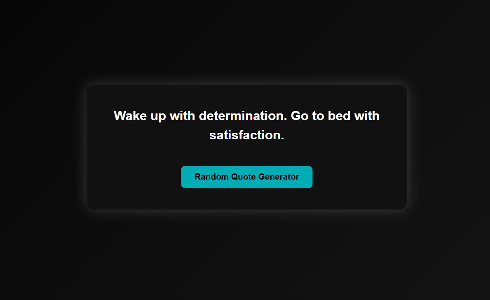

# 🎯 Random Quote Generator


---

## 📌 Overview

A simple and elegant **Random Quote Generator** built using HTML, CSS, and JavaScript.  
Click the button to generate inspiring quotes instantly.

---

## 🌐 Live Demo

https://your-username.github.io/random-quote-generator/

---
## 📸 Preview



---

## 🚀 Features

- Random quote generation  
- Fast and lightweight  
- Clean UI  
- Fully responsive  

---

## 🛠️ Tech Stack

- HTML  
- CSS  
- JavaScript  

---

## 📂 Project Structure

```
Random-Quote-Generator/
├── index.html
├── style.css
├── script.js
```

---

## ⚙️ How It Works

```javascript
const index = Math.floor(Math.random() * quotes.length);
quote.textContent = quotes[index];
```

---

## 🧑‍💻 Run Locally

```bash
git clone https://github.com/your-username/random-quote-generator.git
cd Random-Quote-Generator
```

Open index.html in your browser

---

## 🚀 Deployment

Go to Settings → Pages → Select main branch → Save

Live URL:
```
https://your-username.github.io/random-quote-generator/
```

---

## 📄 License

MIT License

---

## 👨‍💻 Author

Mahtab Alam

---

## ⭐ Support

Give it a star if you like it